<p align="center">
  
</p>

<h1 align="center">🛡️ CYBER-ICON</h1>
<h3 align="center">Cybersecurity Icon Library for Presentations & Education</h3>

<p align="center">
  
  
  
  
</p>

---

A curated collection of **240 cybersecurity icons** organized into **36 categories**, designed for use in lecture slides, presentations, and educational materials for the **Cyber Security 101** course.

## 📋 Table of Contents

| # | Category | Count | # | Category | Count |
|:-:|:---------|:-----:|:-:|:---------|:-----:|
| 1 | [🤖 AI](#-ai) | 3 | 19 | [🔒 NetSec](#-netsec) | 7 |
| 2 | [⚔️ AI Attack](#️-ai-attack) | 3 | 20 | [🌐 Network](#-network) | 11 |
| 3 | [🧰 AI Tool](#-ai-tool) | 5 | 21 | [💻 OS](#-os) | 8 |
| 4 | [💥 Attack](#-attack) | 1 | 22 | [🔍 OSINT](#-osint) | 4 |
| 5 | [🖼️ BackGround](#️-background) | 7 | 23 | [📚 Resource](#-resource) | 3 |
| 6 | [📢 Channel](#-channel) | 2 | 24 | [🔬 RevEng](#-reveng) | 5 |
| 7 | [🔐 CIA](#-cia) | 3 | 25 | [🔑 Sec](#-sec) | 1 |
| 8 | [💡 Concept](#-concept) | 4 | 26 | [🛡️ SecOps](#️-secops) | 2 |
| 9 | [🕸️ DarkWeb](#️-darkweb) | 3 | 27 | [🎭 SocEng](#-soceng) | 6 |
| 10 | [📦 Delivery](#-delivery) | 6 | 28 | [🔓 System Hacking](#-system-hacking) | 1 |
| 11 | [👨‍💻 Dev](#-dev) | 8 | 29 | [📖 Term](#-term) | 8 |
| 12 | [🔄 DevSecOps](#-devsecops) | 1 | 30 | [🛠️ Tool](#️-tool) | 41 |
| 13 | [🖧 Device](#-device) | 4 | 31 | [🌍 Web](#-web) | 5 |
| 14 | [🔎 Forensics](#-forensics) | 13 | 32 | [🐛 Web Vuln](#-web-vuln) | 9 |
| 15 | [🔩 Hardware](#-hardware) | 5 | 33 | [🧅 WebLayer](#-weblayer) | 12 |
| 16 | [🚨 IOC](#-ioc) | 11 | 34 | [📡 WiFi](#-wifi) | 9 |
| 17 | [🧪 Lab](#-lab) | 5 | 35 | [⚡ WiFi Attack](#-wifi-attack) | 6 |
| 18 | [🦠 Malware & Analysis](#-malware--analysis) | 18 | 36 | | |

---

## 📁 Naming Convention

All icons follow a consistent naming pattern:

```
[Category] - [Descriptive Name].[ext]
```

**Examples:**
- `Tool - Wireshark.png`
- `Malware - Ransomware.png`
- `Network - OSI Model Layers.png`
- `WiFi Attack - Evil Twin.png`

---

## 🤖 AI

*Artificial Intelligence in cybersecurity — both offensive and defensive applications.*

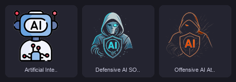

| Icon | Filename |
|:-----|:---------|
|  | `AI - Artificial Intelligence Force Multiplier.png` |
|  | `AI - Defensive AI SOAR.png` |
|  | `AI - Offensive AI Attacks.png` |

---

## ⚔️ AI Attack

*Attack vectors targeting AI/ML systems.*

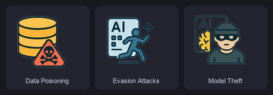

| Icon | Filename |
|:-----|:---------|
|  | `AI Attack - Data Poisoning.png` |
|  | `AI Attack - Evasion Attacks.png` |
|  | `AI Attack - Model Theft.png` |

---

## 🧰 AI Tool

*AI platforms and frameworks used in cybersecurity workflows.*

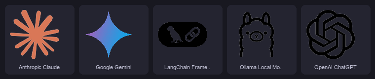

| Icon | Filename |
|:-----|:---------|
|  | `AI Tool - Anthropic Claude.png` |
|  | `AI Tool - Google Gemini.png` |
|  | `AI Tool - LangChain Framework.png` |
|  | `AI Tool - Ollama Local Models.png` |
|  | `AI Tool - OpenAI ChatGPT.png` |

---

## 💥 Attack

*General attack concepts and payloads.*

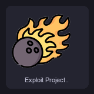

| Icon | Filename |
|:-----|:---------|
|  | `Attack - Exploit Projectile Payload.png` |

---

## 🖼️ BackGround

*Backgrounds and wallpapers for presentation modules.*

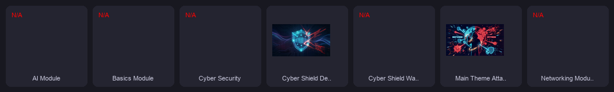

| Icon | Filename |
|:-----|:---------|
|  | `BackGround - Cyber Shield Defense.png` |
|  | `BackGround - Main Theme Attack vs Defense.png` |
|  | `BackGround - AI Module.wdp` |
|  | `BackGround - Basics Module.wdp` |
|  | `BackGround - Cyber Security.wdp` |
|  | `BackGround - Cyber Shield Wallpaper.wdp` |
|  | `BackGround - Networking Module.wdp` |

---

## 📢 Channel

*Social and publishing platforms.*


| Icon | Filename |
|:-----|:---------|
|  | `Channel - GitHub Account.png` |
|  | `Channel - Medium Account.png` |

---

## 🔐 CIA

*The CIA Triad — the foundation of information security.*

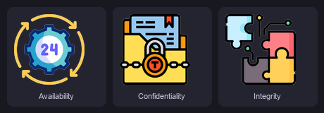

| Icon | Filename |
|:-----|:---------|
|  | `CIA - Availability.png` |
|  | `CIA - Confidentiality.png` |
|  | `CIA - Integrity.png` |

---

## 💡 Concept

*Foundational cybersecurity concepts and myths.*


| Icon | Filename |
|:-----|:---------|
|  | `Concept - Anonymous Hacker Myth.png` |
|  | `Concept - Missing Theoretical Concepts.png` |
|  | `Concept - Myth vs Reality Broken Link.png` |
|  | `Concept - Tech Innovation Idea.png` |

---

## 🕸️ DarkWeb

*Dark web concepts and anonymity networks.*

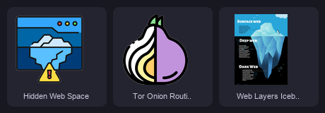

| Icon | Filename |
|:-----|:---------|
|  | `DarkWeb - Hidden Web Space.png` |
|  | `DarkWeb - Tor Onion Routing Relays.png` |
|  | `DarkWeb - Web Layers Iceberg.png` |

---

## 📦 Delivery

*Malware delivery mechanisms and infection vectors.*

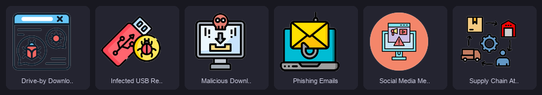

| Icon | Filename |
|:-----|:---------|
|  | `Delivery - Drive-by Downloads.png` |
|  | `Delivery - Infected USB Removable Media.png` |
|  | `Delivery - Malicious Downloads.png` |
|  | `Delivery - Phishing Emails.png` |
|  | `Delivery - Social Media Messaging Links.png` |
|  | `Delivery - Supply Chain Attacks.png` |

---

## 👨‍💻 Dev

*Programming languages and development tools used in security.*

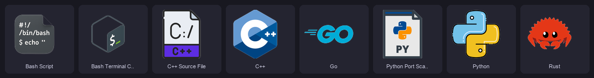

| Icon | Filename |
|:-----|:---------|
|  | `Dev - Bash Script.png` |
|  | `Dev - Bash Terminal CLI.png` |
|  | `Dev - C++ Source File.png` |
|  | `Dev - C++.png` |
|  | `Dev - Go.png` |
|  | `Dev - Python Port Scanner Script.png` |
|  | `Dev - Python.png` |
|  | `Dev - Rust.png` |

---

## 🔄 DevSecOps

*Security integrated into the development lifecycle.*

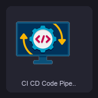

| Icon | Filename |
|:-----|:---------|
|  | `DevSecOps - CI CD Code Pipeline.png` |

---

## 🖧 Device

*Network hardware and infrastructure devices.*

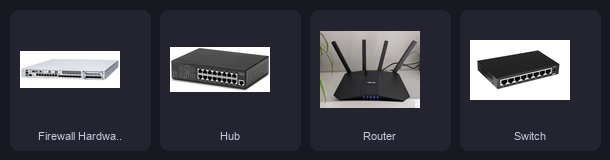

| Icon | Filename |
|:-----|:---------|
|  | `Device - Firewall Hardware.jpg` |
|  | `Device - Hub.jpg` |
|  | `Device - Router.jpg` |
|  | `Device - Switch.png` |

---

## 🔎 Forensics

*Digital forensics disciplines and evidence handling.*


| Icon | Filename |
|:-----|:---------|
|  | `Forensics - Artifact Verification.png` |
|  | `Forensics - Biometric Scanner.png` |
|  | `Forensics - Cloud Forensics.png` |
|  | `Forensics - Computer Forensics.png` |
|  | `Forensics - Database Forensics.png` |
|  | `Forensics - Digital Identity Evidence.png` |
|  | `Forensics - Disk Forensics.png` |
|  | `Forensics - Email Forensics.png` |
|  | `Forensics - Evidence Investigation.png` |
|  | `Forensics - Forensic Inspection.png` |
|  | `Forensics - Mobile Forensics.png` |
|  | `Forensics - Network Forensics.png` |
|  | `Forensics - Physical Storage Platter.png` |

---

## 🔩 Hardware

*Hardware components and low-level computing concepts.*

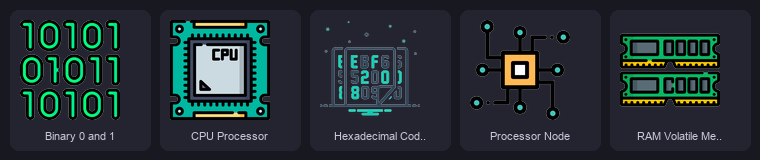

| Icon | Filename |
|:-----|:---------|
|  | `Hardware - Binary 0 and 1.png` |
|  | `Hardware - CPU Processor.png` |
|  | `Hardware - Hexadecimal Code Dump.png` |
|  | `Hardware - Processor Node.png` |
|  | `Hardware - RAM Volatile Memory.png` |

---

## 🚨 IOC

*Indicators of Compromise — host-based and network-based.*

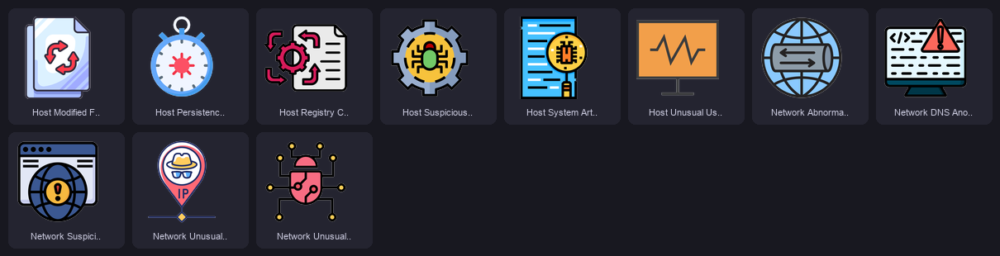

| Icon | Filename |
|:-----|:---------|
|  | `IOC - Host Modified Files.png` |
|  | `IOC - Host Persistence Changes.png` |
|  | `IOC - Host Registry Changes.png` |
|  | `IOC - Host Suspicious Processes.png` |
|  | `IOC - Host System Artifacts.png` |
|  | `IOC - Host Unusual User Activity.png` |
|  | `IOC - Network Abnormal Traffic Spikes.png` |
|  | `IOC - Network DNS Anomalies.png` |
|  | `IOC - Network Suspicious Domains C2.png` |
|  | `IOC - Network Unusual IP Locations.png` |
|  | `IOC - Network Unusual Ports Protocols.png` |

---

## 🧪 Lab

*Lab environment setup and target machines.*


| Icon | Filename |
|:-----|:---------|
|  | `Lab - Kali Linux.png` |
|  | `Lab - Metasploitable 2 Target.png` |
|  | `Lab - USB WiFi Adapter.png` |
|  | `Lab - VirtualBox.png` |
|  | `Lab - Windows Memory Analysis Target.png` |

---

## 🦠 Malware & Analysis

*Malware types and analysis methodologies.*

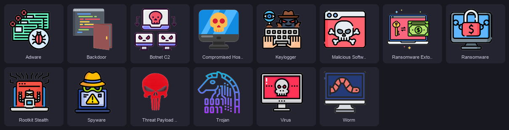
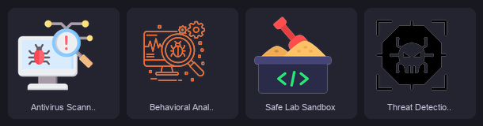

| Icon | Filename | Icon | Filename |
|:-----|:---------|:-----|:---------|
|  | `Malware - Adware.png` |  | `Malware - Ransomware.png` |
|  | `Malware - Backdoor.png` |  | `Malware - Ransomware Extortion.png` |
|  | `Malware - Botnet C2.png` |  | `Malware - Rootkit Stealth.png` |
|  | `Malware - Compromised Host Infection.png` |  | `Malware - Spyware.png` |
|  | `Malware - Keylogger.png` |  | `Malware - Threat Payload Icon.png` |
|  | `Malware - Malicious Software Definition.png` |  | `Malware - Trojan.png` |
|  | `Malware - Virus.png` |  | `Malware - Worm.png` |

**Analysis Tools:**

| Icon | Filename |
|:-----|:---------|
|  | `MalAnalysis - Antivirus Scanner.png` |
|  | `MalAnalysis - Behavioral Analysis.png` |
|  | `MalAnalysis - Safe Lab Sandbox.png` |
|  | `MalAnalysis - Threat Detection Goals.png` |

---

## 🔒 NetSec

*Network security controls and attack types.*

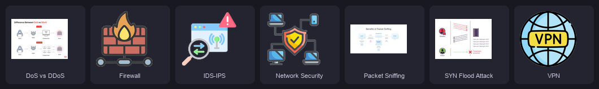

| Icon | Filename |
|:-----|:---------|
|  | `NetSec - DoS vs DDoS.png` |
|  | `NetSec - Firewall.png` |
|  | `NetSec - IDS-IPS.png` |
|  | `NetSec - Network Security.png` |
|  | `NetSec - Packet Sniffing.png` |
|  | `NetSec - SYN Flood Attack.jpg` |
|  | `NetSec - VPN.png` |

---

## 🌐 Network

*Networking fundamentals — protocols, models, and addressing.*

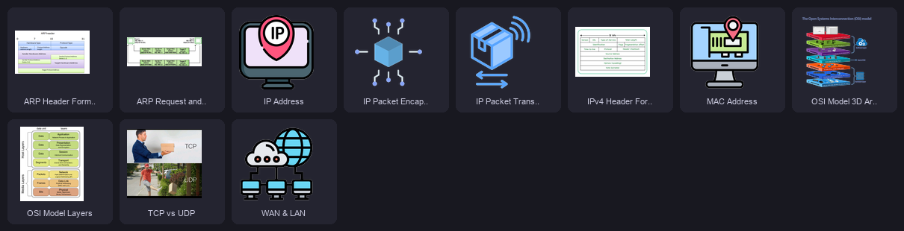

| Icon | Filename |
|:-----|:---------|
|  | `Network - ARP Header Format.png` |
|  | `Network - ARP Request and Reply.jpeg` |
|  | `Network - IP Address.png` |
|  | `Network - IP Packet Encapsulation.png` |
|  | `Network - IP Packet Transmission.png` |
|  | `Network - IPv4 Header Format.jpg` |
|  | `Network - MAC Address.png` |
|  | `Network - OSI Model 3D Architecture.png` |
|  | `Network - OSI Model Layers.png` |
|  | `Network - TCP vs UDP.jpeg` |
|  | `Network - WAN & LAN.png` |

---

## 💻 OS

*Operating systems and process fundamentals.*

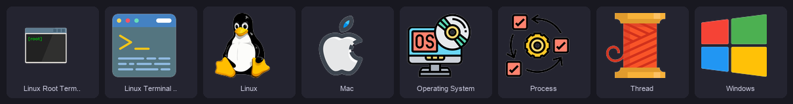

| Icon | Filename |
|:-----|:---------|
|  | `OS - Linux Root Terminal.png` |
|  | `OS - Linux Terminal CLI.png` |
|  | `OS - Linux.png` |
|  | `OS - Mac.png` |
|  | `OS - Operating System.png` |
|  | `OS - Process.png` |
|  | `OS - Thread.png` |
|  | `OS - Windows.png` |

---

## 🔍 OSINT

*Open Source Intelligence gathering techniques.*


| Icon | Filename |
|:-----|:---------|
|  | `OSINT - Google Dorking Search Operators.png` |
|  | `OSINT - Infrastructure Analysis.png` |
|  | `OSINT - Public Credential Leaks.png` |
|  | `OSINT - Social Media Intelligence SOCMINT.png` |

---

## 📚 Resource

*Recommended learning platforms and training resources.*

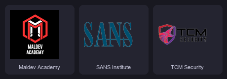

| Icon | Filename |
|:-----|:---------|
|  | `Resource - Maldev Academy.png` |
|  | `Resource - SANS Institute.png` |
|  | `Resource - TCM Security.png` |

---

## 🔬 RevEng

*Reverse engineering techniques and analysis methods.*

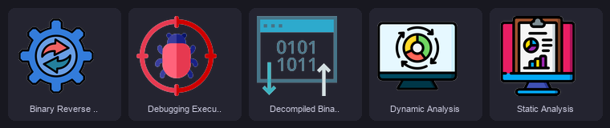

| Icon | Filename |
|:-----|:---------|
|  | `RevEng - Binary Reverse Engineering.png` |
|  | `RevEng - Debugging Execution.png` |
|  | `RevEng - Decompiled Binary Stream.png` |
|  | `RevEng - Dynamic Analysis.png` |
|  | `RevEng - Static Analysis.png` |

---

## 🔑 Sec

*Core security concepts.*

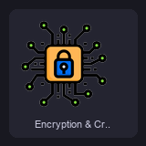

| Icon | Filename |
|:-----|:---------|
|  | `Sec - Encryption & Cryptography.png` |

---

## 🛡️ SecOps

*Security operations and defensive strategies.*

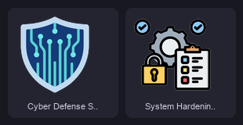

| Icon | Filename |
|:-----|:---------|
|  | `SecOps - Cyber Defense Shield.png` |
|  | `SecOps - System Hardening & Patching.png` |

---

## 🎭 SocEng

*Social engineering attack techniques.*

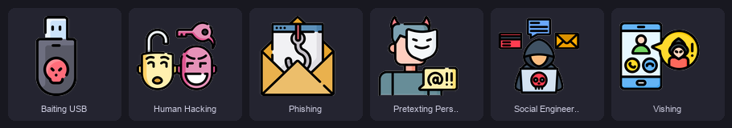

| Icon | Filename |
|:-----|:---------|
|  | `SocEng - Baiting USB.png` |
|  | `SocEng - Human Hacking.png` |
|  | `SocEng - Phishing.png` |
|  | `SocEng - Pretexting Persona.png` |
|  | `SocEng - Social Engineering & OSINT.png` |
|  | `SocEng - Vishing.png` |

---

## 🔓 System Hacking

*System-level exploitation techniques.*

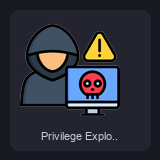

| Icon | Filename |
|:-----|:---------|
|  | `System Hacking - Privilege Exploitation.png` |

---

## 📖 Term

*Core cybersecurity terminology and definitions.*

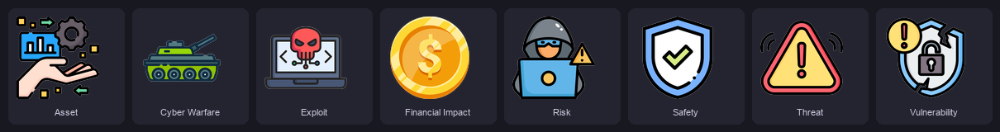

| Icon | Filename |
|:-----|:---------|
|  | `Term - Asset.png` |
|  | `Term - Cyber Warfare.png` |
|  | `Term - Exploit.png` |
|  | `Term - Financial Impact.png` |
|  | `Term - Risk.png` |
|  | `Term - Safety.png` |
|  | `Term - Threat.png` |
|  | `Term - Vulnerability.png` |

---

## 🛠️ Tool

*Security tools, frameworks, and platforms — the largest category.*

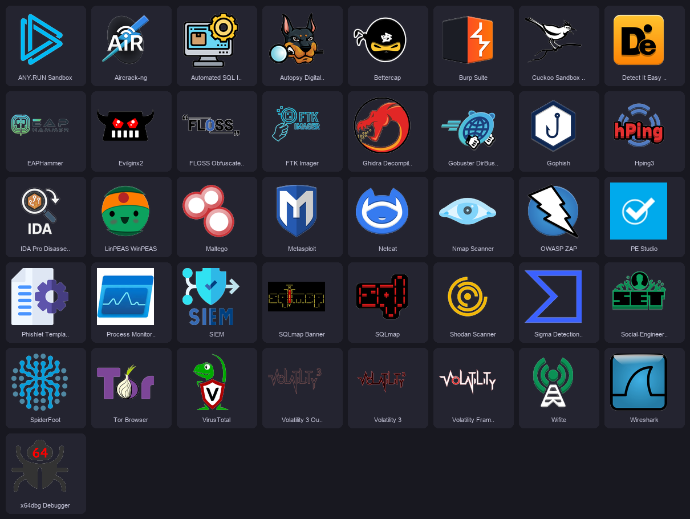

| Icon | Filename | Icon | Filename |
|:-----|:---------|:-----|:---------|
|  | `Tool - Aircrack-ng.png` |  | `Tool - Netcat.png` |
|  | `Tool - ANY.RUN Sandbox.png` |  | `Tool - Nmap Scanner.png` |
|  | `Tool - Automated SQL Injection.png` |  | `Tool - OWASP ZAP.png` |
|  | `Tool - Autopsy Digital Forensics.png` |  | `Tool - PE Studio.png` |
|  | `Tool - Bettercap.png` |  | `Tool - Phishlet Template YAML.png` |
|  | `Tool - Burp Suite.png` |  | `Tool - Process Monitor Procmon.jpeg` |
|  | `Tool - Cuckoo Sandbox Local.png` |  | `Tool - Shodan Scanner.png` |
|  | `Tool - Detect It Easy DIE.png` |  | `Tool - SIEM.png` |
|  | `Tool - EAPHammer.png` |  | `Tool - Sigma Detection Rules.png` |
|  | `Tool - Evilginx2.png` |  | `Tool - Social-Engineer Toolkit SET.png` |
|  | `Tool - FLOSS Obfuscated Strings.png` |  | `Tool - SpiderFoot.png` |
|  | `Tool - FTK Imager.png` |  | `Tool - SQLmap Banner.png` |
|  | `Tool - Ghidra Decompiler.png` |  | `Tool - SQLmap.png` |
|  | `Tool - Gobuster DirBuster.png` |  | `Tool - Tor Browser.png` |
|  | `Tool - Gophish.png` |  | `Tool - VirusTotal.png` |
|  | `Tool - Hping3.png` |  | `Tool - Volatility 3 Outline.png` |
|  | `Tool - IDA Pro Disassembler.png` |  | `Tool - Volatility 3.png` |
|  | `Tool - LinPEAS WinPEAS.png` |  | `Tool - Volatility Framework.png` |
|  | `Tool - Maltego.png` |  | `Tool - Wifite.png` |
|  | `Tool - Metasploit.png` |  | `Tool - Wireshark.png` |
| | |  | `Tool - x64dbg Debugger.png` |

---

## 🌍 Web

*Web security fundamentals and testing.*

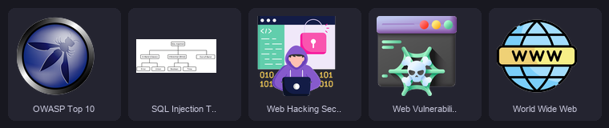

| Icon | Filename |
|:-----|:---------|
|  | `Web - OWASP Top 10.png` |
|  | `Web - SQL Injection Types Taxonomy.png` |
|  | `Web - Web Hacking Security Testing.png` |
|  | `Web - Web Vulnerability Attack.png` |
|  | `Web - World Wide Web.png` |

---

## 🐛 Web Vuln

*Specific web application vulnerabilities (OWASP-aligned).*

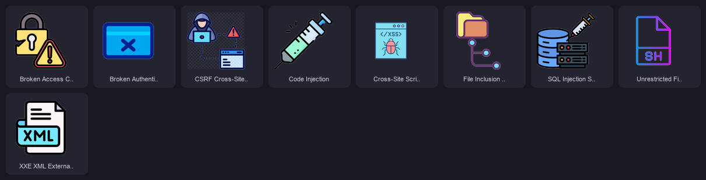

| Icon | Filename |
|:-----|:---------|
|  | `Web Vuln - Broken Access Control.png` |
|  | `Web Vuln - Broken Authentication.png` |
|  | `Web Vuln - Code Injection.png` |
|  | `Web Vuln - Cross-Site Scripting XSS.png` |
|  | `Web Vuln - CSRF Cross-Site Request Forgery.png` |
|  | `Web Vuln - File Inclusion LFI-RFI.png` |
|  | `Web Vuln - SQL Injection SQLi.png` |
|  | `Web Vuln - Unrestricted File Upload.png` |
|  | `Web Vuln - XXE XML External Entity Injection.png` |

---

## 🧅 WebLayer

*Surface, Deep, and Dark Web layer representations.*

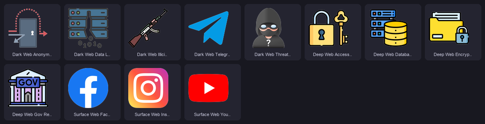

| Icon | Filename |
|:-----|:---------|
|  | `WebLayer - Surface Web Facebook.png` |
|  | `WebLayer - Surface Web Instagram.png` |
|  | `WebLayer - Surface Web YouTube.png` |
|  | `WebLayer - Deep Web Access Control.png` |
|  | `WebLayer - Deep Web Database Storage.png` |
|  | `WebLayer - Deep Web Encrypted Data.png` |
|  | `WebLayer - Deep Web Gov Records.png` |
|  | `WebLayer - Dark Web Anonymity Bypass.png` |
|  | `WebLayer - Dark Web Data Leaks.png` |
|  | `WebLayer - Dark Web Illicit Markets.png` |
|  | `WebLayer - Dark Web Telegram Black Markets.png` |
|  | `WebLayer - Dark Web Threat Actors.png` |

---

## 📡 WiFi

*Wireless networking concepts, protocols, and vulnerabilities.*

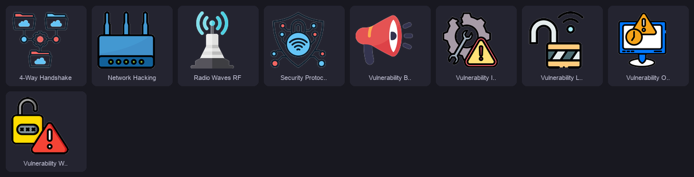

| Icon | Filename |
|:-----|:---------|
|  | `WiFi - 4-Way Handshake.png` |
|  | `WiFi - Network Hacking.png` |
|  | `WiFi - Radio Waves RF.png` |
|  | `WiFi - Security Protocols WPA3.png` |
|  | `WiFi - Vulnerability Broadcast Medium.png` |
|  | `WiFi - Vulnerability Insecure Config.png` |
|  | `WiFi - Vulnerability Legacy WEP-WPS.png` |
|  | `WiFi - Vulnerability Outdated Firmware.png` |
|  | `WiFi - Vulnerability Weak Passwords.png` |

---

## ⚡ WiFi Attack

*Wireless attack techniques and methodologies.*

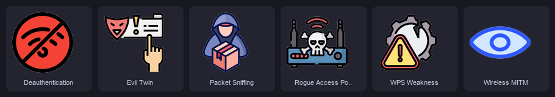

| Icon | Filename |
|:-----|:---------|
|  | `WiFi Attack - Deauthentication.png` |
|  | `WiFi Attack - Evil Twin.png` |
|  | `WiFi Attack - Packet Sniffing.png` |
|  | `WiFi Attack - Rogue Access Point.png` |
|  | `WiFi Attack - Wireless MITM.png` |
|  | `WiFi Attack - WPS Weakness.png` |

---

## 📊 Statistics

| Metric | Value |
|:-------|:------|
| **Total Icons** | 240 |
| **Categories** | 36 |
| **Largest Category** | Tool (41 icons) |
| **Formats** | PNG, JPG, JPEG, WDP |
| **Naming Convention** | `[Category] - [Description].[ext]` |

## 🗂️ Category Distribution

```
Tool          ██████████████████████████████████████████░ 41
Malware       ██████████████░░░░░░░░░░░░░░░░░░░░░░░░░░░░ 14
Forensics     █████████████░░░░░░░░░░░░░░░░░░░░░░░░░░░░░ 13
WebLayer      ████████████░░░░░░░░░░░░░░░░░░░░░░░░░░░░░░ 12
IOC           ███████████░░░░░░░░░░░░░░░░░░░░░░░░░░░░░░░ 11
Network       ███████████░░░░░░░░░░░░░░░░░░░░░░░░░░░░░░░ 11
Web Vuln      █████████░░░░░░░░░░░░░░░░░░░░░░░░░░░░░░░░░  9
WiFi          █████████░░░░░░░░░░░░░░░░░░░░░░░░░░░░░░░░░  9
Dev           ████████░░░░░░░░░░░░░░░░░░░░░░░░░░░░░░░░░░  8
OS            ████████░░░░░░░░░░░░░░░░░░░░░░░░░░░░░░░░░░  8
Term          ████████░░░░░░░░░░░░░░░░░░░░░░░░░░░░░░░░░░  8
BackGround    ███████░░░░░░░░░░░░░░░░░░░░░░░░░░░░░░░░░░░  7
NetSec        ███████░░░░░░░░░░░░░░░░░░░░░░░░░░░░░░░░░░░  7
Delivery      ██████░░░░░░░░░░░░░░░░░░░░░░░░░░░░░░░░░░░░  6
SocEng        ██████░░░░░░░░░░░░░░░░░░░░░░░░░░░░░░░░░░░░  6
WiFi Attack   ██████░░░░░░░░░░░░░░░░░░░░░░░░░░░░░░░░░░░░  6
AI Tool       █████░░░░░░░░░░░░░░░░░░░░░░░░░░░░░░░░░░░░░  5
Hardware      █████░░░░░░░░░░░░░░░░░░░░░░░░░░░░░░░░░░░░░  5
Lab           █████░░░░░░░░░░░░░░░░░░░░░░░░░░░░░░░░░░░░░  5
RevEng        █████░░░░░░░░░░░░░░░░░░░░░░░░░░░░░░░░░░░░░  5
Web           █████░░░░░░░░░░░░░░░░░░░░░░░░░░░░░░░░░░░░░  5
Concept       ████░░░░░░░░░░░░░░░░░░░░░░░░░░░░░░░░░░░░░░  4
Device        ████░░░░░░░░░░░░░░░░░░░░░░░░░░░░░░░░░░░░░░  4
MalAnalysis   ████░░░░░░░░░░░░░░░░░░░░░░░░░░░░░░░░░░░░░░  4
OSINT         ████░░░░░░░░░░░░░░░░░░░░░░░░░░░░░░░░░░░░░░  4
AI            ███░░░░░░░░░░░░░░░░░░░░░░░░░░░░░░░░░░░░░░░  3
AI Attack     ███░░░░░░░░░░░░░░░░░░░░░░░░░░░░░░░░░░░░░░░  3
CIA           ███░░░░░░░░░░░░░░░░░░░░░░░░░░░░░░░░░░░░░░░  3
DarkWeb       ███░░░░░░░░░░░░░░░░░░░░░░░░░░░░░░░░░░░░░░░  3
Resource      ███░░░░░░░░░░░░░░░░░░░░░░░░░░░░░░░░░░░░░░░  3
Channel       ██░░░░░░░░░░░░░░░░░░░░░░░░░░░░░░░░░░░░░░░░  2
SecOps        ██░░░░░░░░░░░░░░░░░░░░░░░░░░░░░░░░░░░░░░░░  2
Attack        █░░░░░░░░░░░░░░░░░░░░░░░░░░░░░░░░░░░░░░░░░  1
DevSecOps     █░░░░░░░░░░░░░░░░░░░░░░░░░░░░░░░░░░░░░░░░░  1
Sec           █░░░░░░░░░░░░░░░░░░░░░░░░░░░░░░░░░░░░░░░░░  1
Sys Hacking   █░░░░░░░░░░░░░░░░░░░░░░░░░░░░░░░░░░░░░░░░░  1
```

---

<p align="center">
  <b>Cyber Security 101</b> — Educational Icon Library<br/>
  <sub>Icons are organized for use in course materials and presentations.</sub>
</p>
